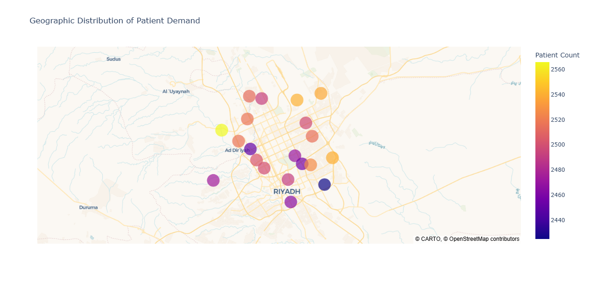
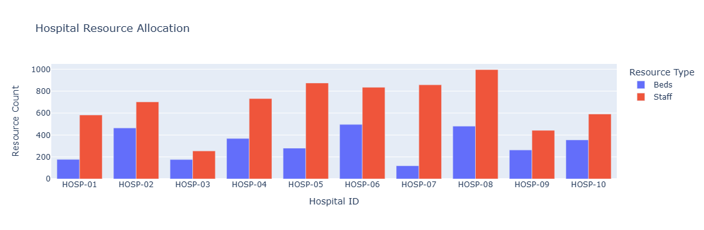
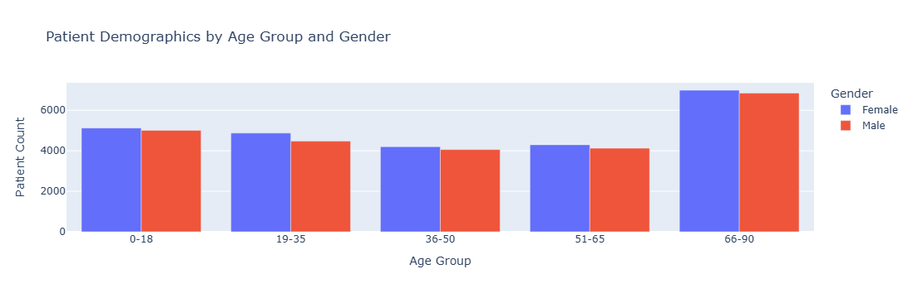
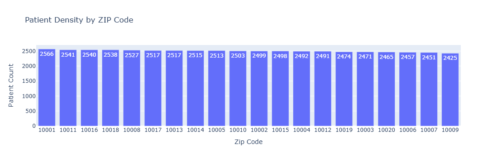
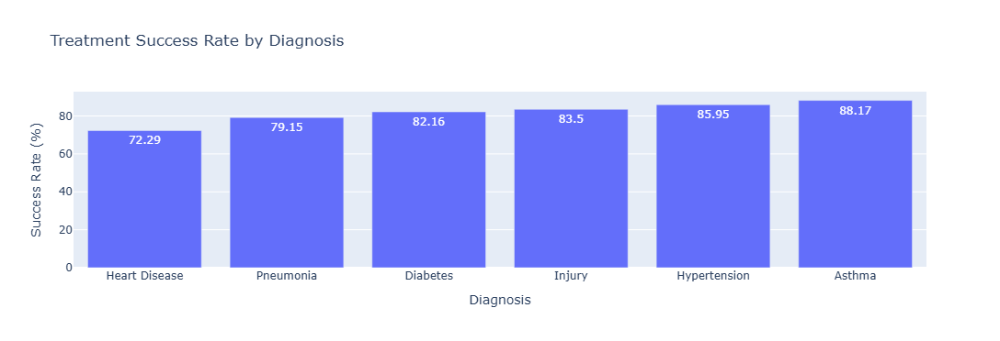
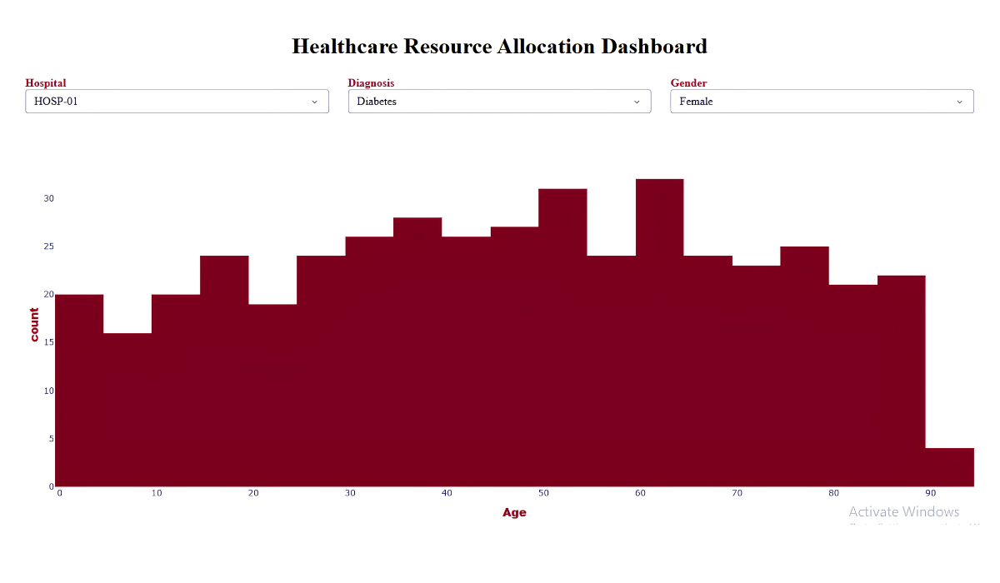

# Healthcare Resource Allocation Visualization

## SkilledScore Data Visualization Internship

**Intern:** Usman Ali  
**Supervisor:** Dr. Zeeshan Usmani  
**Task:**  — Healthcare Resource Allocation Visualization

---

## Project Overview

This project analyzes healthcare resource distribution across a fictional metropolitan area using synthetic patient and hospital data.

The objective is to create an interactive visualization system that explores:

- Patient demand across hospitals and ZIP codes
- Hospital resource allocation
- Patient demographics
- Treatment outcomes
- Geographic distribution of healthcare demand
- Potential resource-demand imbalances

The project was completed as part of the SkilledScore Data Visualization Internship.

---

## Task Objective

Create an interactive dashboard to visualize healthcare resource distribution in a metropolitan area, highlighting demographic breakdowns and treatment efficacy metrics.

The project uses Python, Pandas, NumPy, Plotly, and Dash for data preparation, analysis, visualization, and interactive dashboard development.

---

## Dataset

The project uses **synthetic data** created for analytical and educational purposes.

### Patient Data

The patient dataset contains approximately **50,000 synthetic patient records** across **10 hospitals**.

Key fields include:

- Patient ID
- Age
- Gender
- ZIP Code
- Diagnosis
- Treatment Type
- Hospital ID
- Treatment Outcome
- Cost

### Hospital Resources

Hospital-level resource data includes:

- Hospital ID
- Beds
- Staff
- Location

### Department Resources

Department-level resource data covers hospital departments and their available resources.

---

## Data Preparation

The workflow included:

1. Synthetic patient-data generation
2. Demographic generation using Faker and NumPy
3. Missing-value handling
4. Duplicate checking
5. ZIP-code standardization
6. Diagnosis categorization
7. Treatment-outcome analysis
8. Resource-demand calculations
9. Geographic analysis

---

## Visualizations

### Geographic Patient Demand



### Hospital Resource Allocation



### Patient Demographics



### Patient Density by ZIP Code



### Treatment Efficacy by Diagnosis



### Interactive Healthcare Dashboard



---

## Interactive Dashboard

The dashboard supports interactive exploration using filters including:

- Hospital
- Diagnosis
- Gender

The dashboard brings together resource allocation, demographic patterns, patient demand, and treatment outcomes into a single analytical interface.

---

## Analytical Insights

The analysis examines:

- Differences in patient demand between hospitals
- Hospital resource availability relative to patient demand
- Geographic areas with comparatively high patient density
- Demographic differences in healthcare demand
- Treatment success rates across diagnoses
- Potentially underserved ZIP-code areas

The analysis also identifies areas where healthcare demand and available resources may not be proportionally aligned.

---

## Key Finding

Within the synthetic dataset, treatment success rates vary across diagnosis categories. Heart Disease recorded the lowest treatment-success rate in the analysis at approximately **72.29%**.

These results are based entirely on synthetic data and should not be interpreted as real-world clinical evidence.

---

## Project Structure

```text
healthcare-resource-allocation/
│
├── data/
│   ├── healthcare_patients.csv
│   ├── hospital_resources.csv
│   └── department_resources.csv
│
├── visualizations/
│   ├── geographic-patient-demand-map.png
│   ├── healthcare-resource-allocation-dashboard.png
│   ├── hospital-resource-allocation.png
│   ├── patient-demographics.png
│   ├── patient-density-by-zip-code.png
│   └── treatment-efficacy-by-diagnosis.png
│
├── Healthcare_Resource_Allocation.ipynb
│
└── README.md
